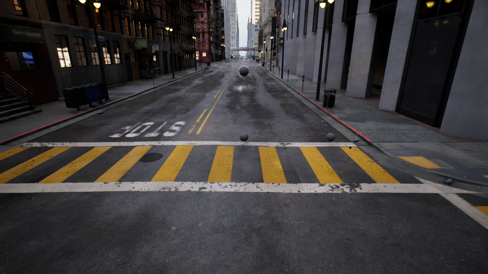
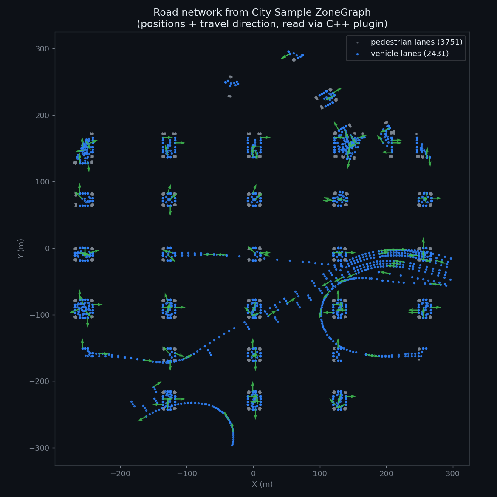
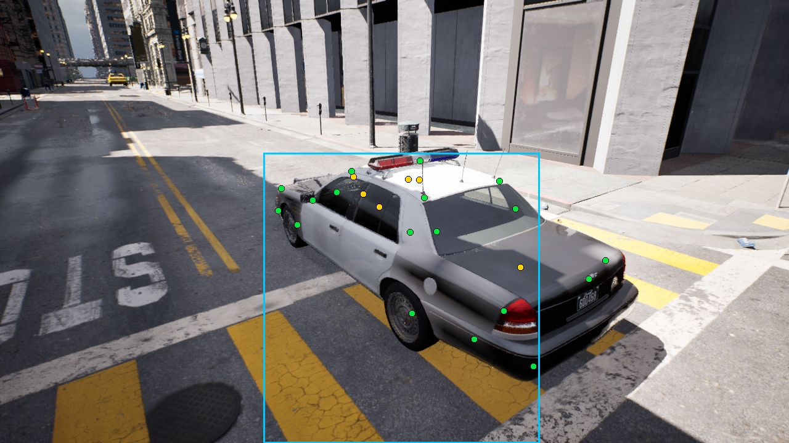
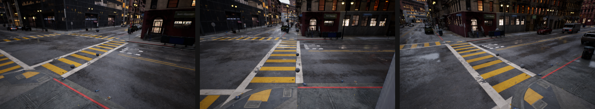

# ue5-vehicle-synth

<em>Synthetic vehicle-keypoint datasets, rendered inside Epic's City Sample with Unreal Engine 5.</em>

Real vehicle-keypoint data is scarce and expensive to label. A game engine renders the same scene with **perfect, free, pixel-exact annotations** and unlimited variety of viewpoint, vehicle, weather, and time of day. This project builds that generator as a reusable Unreal Engine C++ plugin and uses it to extend the [`vehicle-keypoints`](https://github.com/kiselyovd/vehicle-keypoints) model from a 14-point to a 24-point schema with a sim-to-real recipe.

-   :material-city:{ .lg .middle } __Rendered in the Matrix city__

    ---

    Frames come from Epic's City Sample, so the dataset carries a recognizable, high-fidelity look while staying fully redistributable.

    [:octicons-arrow-right-24: How it works](pipeline.md)

-   :material-vector-point:{ .lg .middle } __24-point schema__

    ---

    The first 14 points are the CarFusion canonical order; ten new points (mirrors, bumper and window corners) extend it.

    [:octicons-arrow-right-24: The schema](#the-24-point-schema)

-   :material-flask-outline:{ .lg .middle } __Honest evaluation__

    ---

    A kill switch gates the work: synthetic pre-training must measurably beat the real baseline, or the result is reported as-is.

    [:octicons-arrow-right-24: Status](#status)

-   :material-book-open-variant:{ .lg .middle } __Run it yourself__

    ---

    Step-by-step setup, capture, configuration, and troubleshooting guides.

    [:octicons-arrow-right-24: Project Wiki](https://github.com/kiselyovd/ue5-vehicle-synth/wiki)

## How it works

The pipeline decouples **annotation** (fast, in-editor) from **rendering** (gold-path, offline), kept in lockstep by a keyframed Level Sequence so every rendered frame has a matching label.

=== "1. Road detection"

    A C++ wrapper reads City Sample's baked **ZoneGraph** lane network directly from the engine and returns lane positions plus travel directions. The vehicle is placed on a real lane, aligned to traffic.

    

=== "2. Keypoint projection"

    For each pose, 24 anatomical keypoints are projected to pixels with a bidirectional occlusion trace for CarFusion-style visibility, and a mesh-bounds bounding box that reaches the tire bottoms. Every visible city vehicle is labelled, not just the rig.

    

=== "3. Gold-path render"

    A single camera is keyframed through every pose; **Movie Render Queue** renders each as a sharp 1280x720 frame with full Lumen global illumination.

    

=== "4. Export"

    Per-frame records become a validated multi-instance **COCO** keypoint dataset, consumed directly by the `vehicle-keypoints` training pipeline.

[Read the full engineering walkthrough :octicons-arrow-right-24:](pipeline.md){ .md-button }

## The 24-point schema

| Range | Points | Group |
|---|---|---|
| 0-3 | 4 wheels | CarFusion canonical |
| 4-7 | head / tail lights | CarFusion canonical |
| 8 | exhaust | CarFusion canonical |
| 9-12 | 4 roof corners | CarFusion canonical |
| 13 | body center | CarFusion canonical |
| 14-15 | 2 side mirrors | extension |
| 16-19 | 4 bumper corners | extension |
| 20-23 | 4 window-base corners | extension |

Keeping points 0-13 in the exact CarFusion order means a 24-point model stays backward-compatible with the v1 14-point evaluation. Anchors are defined per vehicle type in `configs/vehicles/`.

## Status

!!! info "Phase 0 vertical slice"
    The capture pipeline, the C++ plugin, ZoneGraph road placement, the gold-path render, and the sim-to-real training driver are built and validated end to end. The current focus is the Phase 0 **kill switch** - synthetic pre-training must lift the v1 model's OKS-mAP by at least +2pp on the CarFusion test set. Results, positive or negative, are documented openly in the repo. A narrow single-city slice is a hard case for sim-to-real transfer; the pipeline and an honest write-up are the deliverable either way.

## Get it

-   :material-github:{ .lg .middle } __Source__

    ---

    Plugin, capture scripts, COCO export, configs.

    [:octicons-arrow-right-24: github.com/kiselyovd/ue5-vehicle-synth](https://github.com/kiselyovd/ue5-vehicle-synth)

-   :material-database-outline:{ .lg .middle } __Dataset__

    ---

    1,440 rendered frames + multi-instance COCO on the Hub.

    [:octicons-arrow-right-24: HuggingFace dataset](https://huggingface.co/datasets/kiselyovd/citysample-vehicle-keypoints-24pt)

## Legal

Frames are non-interactive media rendered with Unreal Engine from City Sample. Under the UE EULA, such rendered images are freely distributable; only the underlying UE-Only-Content asset files are not. This project ships rendered PNG frames and JSON annotations only - never Epic asset files. Full analysis: [City Sample EULA review](legal/CITY_SAMPLE_EULA_REVIEW.md).
